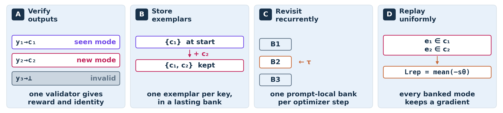

# Re:Max / Re:Dr

**Retain and rehearse the correct solution modes a policy discovers.** Re:Dr adds verified replay to Dr.GRPO; Re:Max adds it to MaxRL. The bank admits only validator-positive responses generated during training, then revisits retained exemplars with a uniform teacher-forced likelihood objective.

[](docs/assets/verified-replay.png)

**Start here:** [install → train → resume → evaluate → interpret](docs/training.md). The walkthrough uses the qualified one-GPU environment and a short PantryPlan run. [ModeBench](https://github.com/liv-daliberti/modeBench) separately owns datasets, validators, and canonical identities.

## Quick start: installed CPU workflow

On Linux x86_64 with Python 3.10–3.12:

```sh
git clone https://github.com/liv-daliberti/remax.git
cd remax
python3.10 -m venv .venv-cpu
source .venv-cpu/bin/activate
python -m pip install --upgrade pip
python -m pip install 'torch==2.6.0+cpu' --index-url https://download.pytorch.org/whl/cpu
python -m pip install .
cd "$(mktemp -d)"
remax walkthrough
remax recipes
remax results list
```

`walkthrough` grades three saved Countdown responses, retains two verified modes, applies a small CPU replay update, and restores bank state. Expect `statuses: ["correct", "correct", "incorrect"]`, `retained_modes: 2`, `prompt_tokens_scored: 0`, and both `parameters_updated` and `bank_restored` to be `true`. It illustrates the [public API](docs/method.md#public-api-walkthrough); it is not a complete RL run. `remax demo` gives an even smaller score-gradient example.

The core install requires Git/network access for pinned ModeBench, but no model weights or training dependencies. GPU training uses a separate Python 3.10 / CUDA 12.4 environment; follow the [training guide](docs/training.md). [Wheel and sdist CI](https://github.com/liv-daliberti/remax/actions/workflows/check.yml) tests both artifacts outside the checkout. No PyPI release is claimed.

## Four matched methods

| Recipe prefix | Fresh objective | Applied replay derivative |
| --- | --- | --- |
| `drgrpo` | Dr.GRPO | Exactly zero; replay still executes |
| `redr` | Dr.GRPO | Uniform verified replay |
| `maxrl` | Binary MaxRL | Exactly zero; replay still executes |
| `remax` | Binary MaxRL | Uniform verified replay |

The 20 maintained recipes cover all five Level-1 domains with pinned Qwen2.5-0.5B-Instruct. Controls retain bank bookkeeping, scheduling, and replay computation. See [method and API](docs/method.md) for objective weighting and [recipe inventory](docs/training.md#recipe-inventory) for settings.

## Results and evidence

```sh
remax results show level2/qwen05b/countdown/replay_maxrl
remax results reproduce level2/qwen05b/countdown/replay_maxrl
remax results verify
```

The installed catalog binds 95 arms and all 475 archived cells, including two excluded from the 473-record analysis. `reproduce` recomputes saved-key numerical results; `verify` checks integrity and bindings only. Six retained summaries are explicitly labeled snapshots. Neither command retrains a model. Historical Level-2/3 and larger-model training exports remain unqualified; the [audit](docs/reproducibility.md#result-packages-and-training-export-audit) records the missing or changed evidence.

## Documentation and ownership

| Guide | Purpose |
| --- | --- |
| [Training workflow](docs/training.md) | Install, authenticate inputs, train, resume, evaluate, read outputs |
| [Method and public API](docs/method.md) | Objectives, executable example, module map, scaling |
| [Reproducibility](docs/reproducibility.md) | Protocols, provenance, results, exclusions |
| [Contributing](CONTRIBUTING.md) | Ownership, quality checks, scientific compatibility policy |
| [Changelog](CHANGELOG.md) | Software and protocol changes |
| [Release scope](RELEASE_STATUS.md) / [validation](VALIDATION.md) | Supported claims and checks actually run |

Repository steward: [Liv G. d'Aliberti](https://github.com/liv-daliberti). Use [issues](https://github.com/liv-daliberti/remax/issues) for software and scientific-contract questions. Code is [Apache-2.0](LICENSE); ModeBench records dataset terms separately.

## Citation

The paper is **accepted at [MATH-AI 2026](https://mathai-2026.github.io/)** and **under review at ICLR 2027**. Please use the approved citation and record your exact Re:Max/ModeBench commits, recipe, model revision, and dataset hashes. Machine-readable metadata is in [CITATION.cff](CITATION.cff).

```bibtex
@inproceedings{dAliberti:etal:ModeCollapse:2027,
  author    = {d'Aliberti, Liv G. and Abdulhai, Marwa and Druchyna, Sofiia and Henderson, Peter and Horta Ribeiro, Manoel},
  title     = {Measuring and Mitigating Solution Mode Collapse in {RLVR}},
  booktitle = {International Conference on Learning Representations ({ICLR})},
  year      = {2027},
  note      = {Under review at {ICLR} 2027},
}
```
