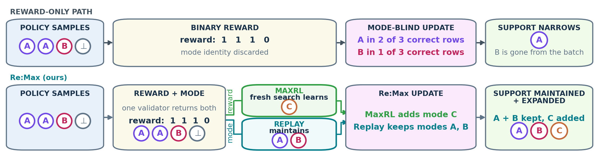

Re:Max / Re:Dr
==============

**Retain and rehearse the correct solution modes a policy discovers.**
Re:Dr adds verified replay to Dr.GRPO; Re:Max adds it to MaxRL. A bank associated
with each prompt stores verified exemplars and rehearses their modes uniformly.

Start with the :doc:`quickstart` CPU walkthrough. Then use :doc:`training` for a
small GPU run, :doc:`resume` to recover it, and :doc:`results` to compare the
retained benchmark evidence.

.. tip::
   This guide targets **remax-rl 0.1.1** with the qualified **modebench 0.4.0**
   dependency. The core supports Linux x86_64 and Python 3.10–3.12. The supported
   GPU training environment is narrower; its hardware and dependency requirements
   are listed before the training commands.

.. toctree::
   :maxdepth: 1
   :caption: User guide

   quickstart
   methods
   training
   resume
   results
   api
   reference
   contributing

`PyPI <https://pypi.org/project/remax-rl/0.1.1/>`_ ·
`GitHub <https://github.com/liv-daliberti/remax>`_ ·
`ModeBench guide <https://liv-daliberti.github.io/modeBench/>`_
